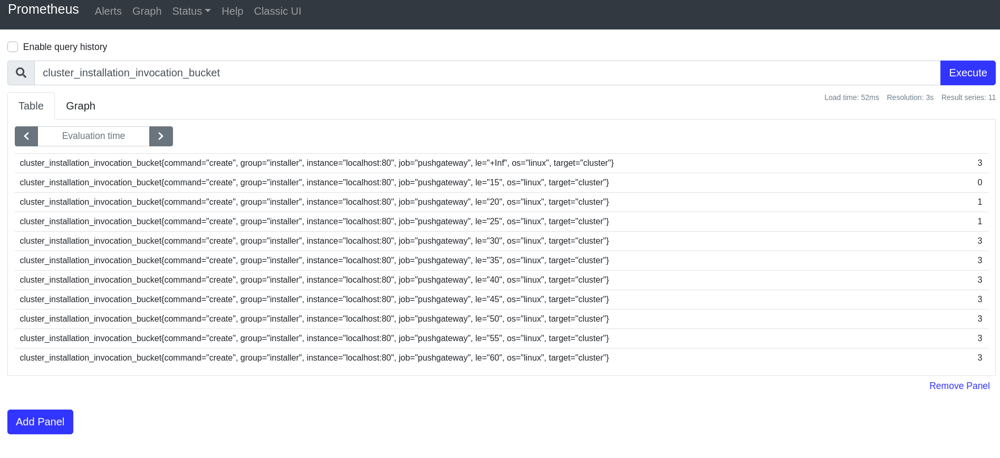

# metrics-faq
This repo provides context and background for the OpenShift Installer telemetry metrics. 

You can simply read through this document to understand how metrics aggregation works with the installer, or you can follow along if you want to play with a local setup.

## Prometheus
First you will need to have Prometheus running locally. You can [download it](https://prometheus.io/download/), as of today the latest release can be downloaded by running:

```
curl -LO https://github.com/prometheus/prometheus/releases/download/v2.16.0/prometheus-2.16.0.linux-amd64.tar.gz
```

Then unzip according to the [Getting Started guide](https://prometheus.io/docs/prometheus/latest/getting_started/):

```
tar xvfz prometheus-*.tar.gz
cd prometheus-*
```

## Standard Pushgateway: Basic Example

It might seem like a good idea for the installer to push metrics whose values have some significance beyond counting towards aggregation. For example, the sample's value could be the duration required for an install. To illustrate the need for the aggregation pushgateway, let's try running the [standard pushgateway](https://github.com/prometheus/pushgateway) as a counterexample. 

First, run the pushgateway on port 9091:
```
podman pull prom/pushgateway

podman run -d -p 9091:9091 prom/pushgateway
```

Then set Prometheus to listen on that port and run it:
```
sed -i 's/9090/9091/g' prometheus.yml
./prometheus --config.file=prometheus.yml
```

For the basic example, let's just use curl to push a metric called `cluster_installation_duration`. The following example could represent a cluster installation on a machine running Linux that took 30 minutes:
```
cat <<EOF | curl --data-binary @- http://localhost:9091/metrics/job/installation
# TYPE cluster_installation_duration gauge
cluster_installation_duration{os="linux"}30
EOF
```

Let's push some more samples. One representing an install that took 20 minutes, and another that took 35. Note that Prometheus scrapes the pushgateway every 15 seconds, so values could be overwritten if they arrive in between scrapes:
```
cat <<EOF | curl --data-binary @- http://localhost:9091/metrics/job/installation
# TYPE cluster_installation_duration gauge
cluster_installation_duration{os="linux"}20
EOF

# wait roughly 15 seconds

cat <<EOF | curl --data-binary @- http://localhost:9091/metrics/job/installation
# TYPE cluster_installation_duration gauge
cluster_installation_duration{os="linux"}35
EOF
```

When we look at the graph running on http://localhost:9090/graph we see a graph that looks something like this:


Each change in the graph denotes a sample pushed to the gateway. But what does this graph tell us? Not much. An even more obvious example would be several consecutive samples with the same value (e.g. all of the installs fell into the 30 minute bucket). We would see a flat line and would have no indication that more than one sample was pushed. 

We must consider values that make sense as a function of time, hence the need for the aggregation gateway. 

## Aggregation Gateway: Basic Example

Instead of updating values in Prometheus, the aggregation pushgateway will add a sample value to the value in Prometheus. In this example, the sample values will always be 1 to represent a single installer invocation. Therefore a metric value in Prometheus would represent how many times the installer has been run fitting the criteria described by the labels.

Stop the standard push gateway and stop Prometheus.

Start the aggregation pushgateway:
```
podman pull weaveworks/prom-aggregation-gateway

sudo podman run -d --rm -p 80:80 weaveworks/prom-aggregation-gateway
```

 We'll point Prometheus to scrape the aggregation pushgateway and restart it:

```
sed -i 's/9091/80/g' prometheus.yml
./prometheus --config.file=prometheus.yml

```


We'll push similar samples to last time, with a couple that fall into the same bucket:

```
echo 'cluster_installation_duration{os="linux", duration="30"}1' | curl --data-binary @- http://localhost/api/ui/metrics

# there is no need to wait between pushes 

echo 'cluster_installation_duration{os="linux", duration="30"}1' | curl --data-binary @- http://localhost/api/ui/metrics

echo 'cluster_installation_duration{os="linux", duration="30"}1' | curl --data-binary @- http://localhost/api/ui/metrics

echo 'cluster_installation_duration{os="linux", duration="25"}1' | curl --data-binary @- http://localhost/api/ui/metrics

```
On http://localhost:9090/graph (querying `cluster_installation_duration`) you should see something like this:


By using the aggregation pushgateway, we can see the growth over time and the current total of installations broken down by categories in labels.


## Aggregation Gateway: Histogram

Grouping installation duration into buckets, e.g. lumping together all installations that took 20-25 minutes, 25-30 minutes, etc., naturally calls for the [histogram metric type](https://prometheus.io/docs/concepts/metric_types/#histogram).

As noted in the link above:

> The Prometheus client libraries offer four core metric types. These are currently only differentiated in the client libraries (to enable APIs tailored to the usage of the specific types) and in the wire protocol. 

We'll use the Go client to illustrate the histogram. 


```
go run histogram.go
```

A dump of the network shows the sample that was sent:

```
# TYPE cluster_installation_invocation histogram
cluster_installation_invocation_bucket{command="create",os="linux",target="cluster",le="15"} 0
cluster_installation_invocation_bucket{command="create",os="linux",target="cluster",le="20"} 0
cluster_installation_invocation_bucket{command="create",os="linux",target="cluster",le="25"} 0
cluster_installation_invocation_bucket{command="create",os="linux",target="cluster",le="30"} 1
cluster_installation_invocation_bucket{command="create",os="linux",target="cluster",le="35"} 1
cluster_installation_invocation_bucket{command="create",os="linux",target="cluster",le="40"} 1
cluster_installation_invocation_bucket{command="create",os="linux",target="cluster",le="45"} 1
cluster_installation_invocation_bucket{command="create",os="linux",target="cluster",le="50"} 1
cluster_installation_invocation_bucket{command="create",os="linux",target="cluster",le="55"} 1
cluster_installation_invocation_bucket{command="create",os="linux",target="cluster",le="60"} 1
cluster_installation_invocation_bucket{command="create",os="linux",target="cluster",le="+Inf"} 1
cluster_installation_invocation_sum{command="create",os="linux",target="cluster"} 30
cluster_installation_invocation_count{command="create",os="linux",target="cluster"} 1
```

The histogram creates buckets through the label `le` (less than or equal). An observed installation duration will be inserted into the appropriate bucket and all buckets greater than. 

If we run the program a few more times and change the values we can see how this works with the aggregation pushgateway. In this case I added 2 more 30 minute installs and a 20 minute install.

